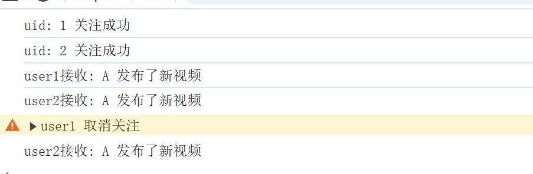
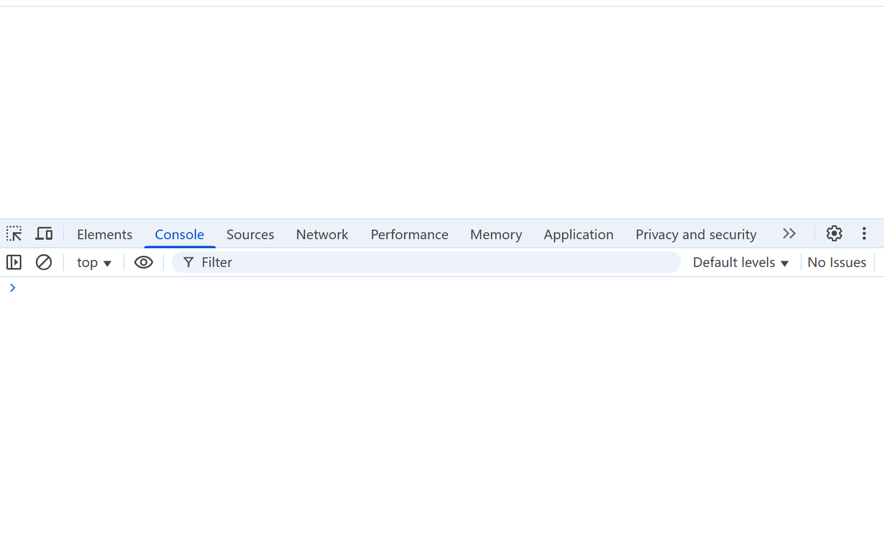
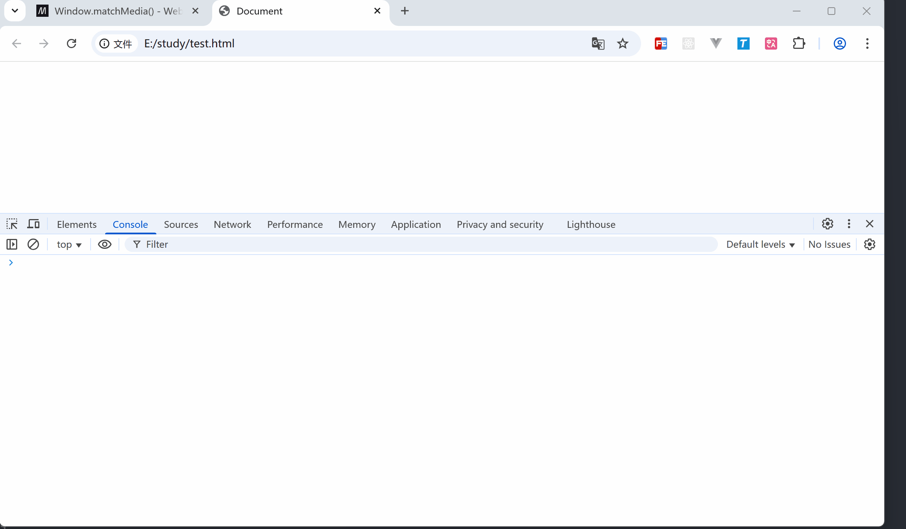

# 通过发布订阅模式实现 ResponsiveObserve

本文的 responsive observe 是基于 [antd responsiveObserver](https://github.com/ant-design/ant-design/blob/4.x-stable/components/_util/responsiveObserve.ts) 的方法解读，在实现 responsive observe 前，我们必须先了解一下 js 的发布订阅模式。

## 了解发布订阅模式

发布订阅模式，好理解的话可以以各视频平台的例子：

- 你和朋友特关了 A 账号
- A 账号发布了一条视频
- 你和朋友收到 A 账号推送
- 你取关了 A 账号
- A 账号再次发布一条视频
- 你收不到 A 账号的推送，朋友依然收到推送

发布就是 A 发布视频，系统去推送视频，订阅就是用户去关注账号。

### 实现最简单的发布订阅

发布订阅的本质就是**事件中心**去管理**用户关注**和**内容推送**

```js
let subscribeId = 0;

const Emitter = {
  events: {},
  // 关注账号
  subscribe(callback) {
    subscribeId += 1;
    this.events[subscribeId] = callback;
    return subscribeId;
  },
  // 推送视频
  dispatch(text) {
    Object.keys(this.events).forEach((subId) => {
      console.log(`uid: ${uid} 关注成功`);
      const cb = this.events[subId];
      cb && cb(text);
    });
  },
  // 取消关注
  unsubscribe(subscribeId) {
    delete this.events[subscribeId];
  },
};

const user1 = (value) => {
  console.log('user1接收:', value);
};

const user2 = (value) => {
  console.log('user2接收:', value);
};

// 关注账号
const user1Id = Emitter.subscribe(user1);
const user2Id = Emitter.subscribe(user2);

// 发布消息
Emitter.dispatch('A 发布了新视频');

// user1取消关注
Emitter.unsubscribe(user1Id);
console.warn('user1 取消订阅');

Emitter.dispatch('A 发布了新视频');
```

代码运行效果如下：



## 实现 ResponsiveObserve

### 认识 matchMedia

[matchMedia](https://developer.mozilla.org/zh-CN/docs/Web/API/Window/matchMedia) 是一个专门用于检测浏览器媒体查询的 API。

为什么不是 `window.resize`？

`window.resize` 监听窗口大小的任意变动，`matchMedia` 则只会在监听的媒体查询条件发生变化时触发，触发频率很低，**简而言之就是优化性能**。

```js
window.addEventListener('resize', function () {
  console.log('resize');
});

window.matchMedia('(max-width: 768px)').addListener(function (MediaQueryList) {
  console.log('matches', MediaQueryList.matches);
});
```

运行效果如下：



### 实现简版 ResponsiveObserve

根据 antd 的实现，我们就~~照抄~~（参考）实现一下

思路也很简单：

- 任意一个 breakpoint 的匹配状态发生变化时，就触发用户订阅回调
- 当用户关闭订阅时，取消各个 breakpoint 的监听

#### 核心功能搭建

- 当用户开启订阅时，注册各个 breakpoint 的监听
- 当媒体查询发生状态变化时，通知订阅者

```js
const responsiveMap = {
  xxl: '(min-width: 1600px)',
  xl: '(min-width: 1200px)',
  lg: '(min-width: 992px)',
  md: '(min-width: 768px)',
  sm: '(min-width: 576px)',
  xs: '(max-width: 575px)',
};
const breakpointArray = Object.keys(responsiveMap);

const ResponsiveObserve = {
  events: {}, // 发布订阅管理中心
  screens: {}, // 屏幕各断点状态集合
  subscribeId: -1, // 订阅者 id

  dispatch(breakpointMatchStatus) {
    this.screens = breakpointMatchStatus;
    Object.keys(this.events).forEach((subId) => {
      const cb = this.events[subId];
      cb && cb(this.screens);
    });
  },

  subscribe(cb) {
    this.subscribeId += 1;
    this.events[this.subscribeId] = cb;
    this.register();
    return this.subscribeId;
  },

  register() {
    breakpointArray.forEach((bp) => {
      const listener = ({ matches }) => {
        // 当媒体查询发生变化时，通知订阅者
        this.dispatch({
          ...this.screens,
          [bp]: matches,
        });
      };

      const mediaQuery = responsiveMap[bp];
      const mql = window.matchMedia(mediaQuery);
      mql.addListener(listener);

      // 初次订阅注册时，必须对 breakpoint 进行初始化的更新，不能等媒体查询后续触发再更新
      listener(mql);
    });
  },
};

ResponsiveObserve.subscribe((screens) => {
  console.log(screens);
});
```



#### 实现卸载逻辑

首先，用户取消订阅，即取消媒体查询时，我们应该将 listener 监听给移除掉

那我们要拿到对应的 listener 才行，这样的话就把 listener 也和 events 一样做一个映射对象：`[媒体查询断点]: listener 监听`

```js
const responsiveMap = {
  xxl: '(min-width: 1600px)',
  xl: '(min-width: 1200px)',
  lg: '(min-width: 992px)',
  md: '(min-width: 768px)',
  sm: '(min-width: 576px)',
  xs: '(max-width: 575px)',
};
const breakpointArray = Object.keys(responsiveMap);

let subscribeId = -1;
let screens = {};

const ResponsiveObserve = {
  // ...
  handlers: {},

  // ...

  // 取消订阅
  unsubscribe(id) {
    delete this.events[id];
    if (Object.keys(this.events).length === 0) {
      this.unregister();
    }
  },

  register() {
    breakpointArray.forEach((bp) => {
      // ...

      // 保存媒体查询的映射对象，方便取消订阅时清空监听器
      this.handlers[mediaQuery] = {
        listener,
        mql,
      };
      // 初次订阅注册时，必须对 breakpoint 进行初始化的更新，不能等媒体查询后续触发再更新
      listener(mql);
    });
  },

  // 解除注册
  unregister() {
    // 移除所有注册的媒体查询监听
    breakpointArray.forEach((bp) => {
      const mediaQuery = responsiveMap[bp];
      const matchHandler = this.handlers[mediaQuery];
      matchHandler.mql.removeListener(matchHandler.listener);
    });
    this.events = {};
  },
};
```

#### 重复注册问题

在以上代码中，我们的 `subscribe` 订阅是没有做媒体监听限制的，即每次订阅都会执行 `this.register()` 函数，重复注册媒体查询监听，我们添加如下代码

```js
const ResponsiveObserve = {
  // ...
  subscribe(cb) {
    if (Object.keys(this.events).length === 0) {
      this.register();
    }
    cb(this.screens);
    this.subscribeId += 1;
    this.events[this.subscribeId] = cb;
  },
};
```

只有不存在订阅者时，才会注册媒体查询监听，而第一次执行 `dispatch` 时，`this.events` 为空，即初次加载拿不到值，因此需要手动执行 `cb`，因为 `this.screens` 值是在 `register` 中赋值，因此 `cb` 是可以拿到断点状态的，且可以避免初次加载时 `dispatch` 执行多次的问题。

### 完整代码

```js
const responsiveMap = {
  xxl: '(min-width: 1600px)',
  xl: '(min-width: 1200px)',
  lg: '(min-width: 992px)',
  md: '(min-width: 768px)',
  sm: '(min-width: 576px)',
  xs: '(max-width: 575px)',
};
const breakpointArray = Object.keys(responsiveMap);

const ResponsiveObserve = {
  events: {},
  screens: {},
  subscribeId: -1,
  handlers: {},

  dispatch(breakpointMatchStatus) {
    this.screens = breakpointMatchStatus;
    Object.keys(this.events).forEach((subId) => {
      const cb = this.events[subId];
      cb && cb(this.screens);
    });
  },

  subscribe(cb) {
    if (Object.keys(this.events).length === 0) {
      this.register();
    }
    cb(this.screens);
    this.subscribeId += 1;
    this.events[this.subscribeId] = cb;
    return this.subscribeId;
  },

  unsubscribe(id) {
    delete this.events[id];
    if (Object.keys(this.events).length === 0) {
      this.unregister();
    }
  },

  register() {
    breakpointArray.forEach((bp) => {
      const listener = ({ matches }) => {
        // 当媒体查询发生变化时，通知订阅者
        this.dispatch({
          ...this.screens,
          [bp]: matches,
        });
      };

      const mediaQuery = responsiveMap[bp];
      const mql = window.matchMedia(mediaQuery);
      mql.addListener(listener);
      this.handlers[mediaQuery] = {
        listener,
        mql,
      };
      // 初次订阅注册时，必须对 breakpoint 进行初始化的更新，不能等媒体查询后续触发再更新
      listener(mql);
    });
  },

  unregister() {
    // 移除所有注册的媒体查询监听
    breakpointArray.forEach((bp) => {
      const mediaQuery = responsiveMap[bp];
      const matchHandler = this.handlers[mediaQuery];
      matchHandler.mql.removeListener(matchHandler.listener);
    });
    this.events = {};
  },
};

const token = ResponsiveObserve.subscribe((screens) => {
  console.log(screens);
});

ResponsiveObserve.unsubscribe(token);
```
